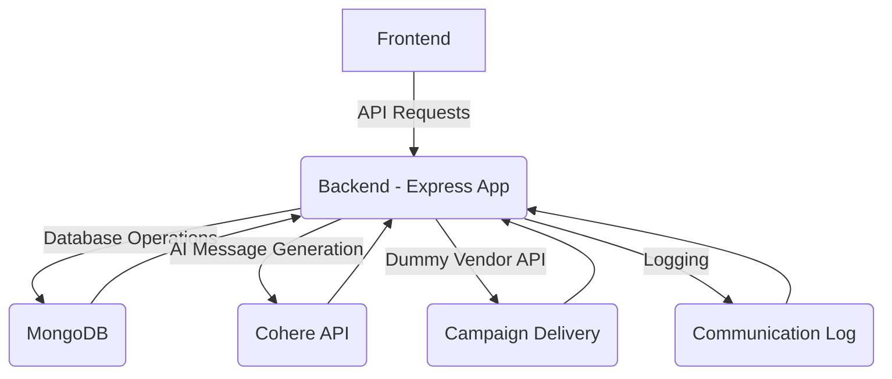

# �� CRM Backend

Hey there! 👋 Welcome to the backend part of our CRM Platform. We've built this with **Node.js + Express + MongoDB** to handle all the heavy lifting for your customer relationship management needs.

## 🎯 What We Handle

Here's what our backend takes care of:
- Secure Google sign-in verification
- Managing your customers and their orders
- Creating smart customer segments
- Running your marketing campaigns
- Tracking campaign performance
- Generating AI-powered messages
- Providing real-time analytics

## 🛠️ The Tech Behind the Magic

We've used some powerful tools to build this:
- Node.js & Express.js for robust API handling
- MongoDB & Mongoose for flexible data storage
- JWT for secure authentication
- dotenv for easy configuration
- node-fetch for external API calls
- Render for reliable hosting

## 🚀 Getting Started

Ready to get things running? Here's how:

1. **First, grab the code:**
    ```bash
    git clone <repository_url>
    cd <repository_name>/backend
    ```

2. **Install the goodies:**
    ```bash
    npm install
    ```

3. **Set up your environment:**
    Create a `.env` file in the `backend` folder and add:
    ```dotenv
    PORT=8000
    MONGODB_URI=your_mongodb_uri
    JWT_SECRET=your_jwt_secret
    COHERE_API_KEY=your_cohere_api_key
    # Feel free to add more settings as needed
    ```
    Don't forget to replace these with your actual credentials!

4. **Start the server:**
    ```bash
    npm run dev
    ```
    Your backend should be up and running! 🚀

## 🏗️ How It All Works

Here's a quick peek under the hood:



Think of it like this: Our Express app is the brain of the operation. It talks to MongoDB to store your data, uses Cohere AI to generate smart messages, and handles all your campaign deliveries. Plus, it keeps track of everything in detailed logs!

## ✨ The Tech Details

Here's what each piece does:
*   **Node.js & Express.js:** Powers our API and handles all your requests
*   **MongoDB & Mongoose:** Stores and manages all your data efficiently
*   **JWT:** Keeps your Google sign-in secure
*   **dotenv:** Makes configuration a breeze
*   **node-fetch:** Helps us talk to other services
*   **cohere-ai:** Powers our smart message generation
*   **Render:** Keeps everything running smoothly in the cloud

## ⚠️ A Few Things to Keep in Mind

*   The campaign delivery system is currently simulated - perfect for testing!
*   Our AI message generation uses Cohere's `command` model, which we can fine-tune for your specific needs
*   We've got basic error handling in place, but we're always working to make it more robust
*   If you're planning to handle massive amounts of data, we might need to add some extra optimizations
